# USB-C PD → 12 V Buck-Boost, 42 W — End-to-End Design Review

Slide source for a **45-minute panel presentation**: 35 minutes of talk, 10 minutes of
questions. Narrative and results live in `README.md` and the notebooks; this file is the
talk track.

**Conventions in this file**

| Marker | Meaning |
|---|---|
| `---` | slide break |
| `## n. Title` | slide title |
| `> **Notes:**` | speaker notes, not shown on the slide |
| `` | figure to place on the slide; paths are repo-relative and all exist unless marked TODO |
| `<!-- TODO -->` | content that still has to be made or checked before presenting |
| *(measured)* *(calculated)* *(datasheet)* *(simulated)* | evidence class for the claim, per the project's evidence standard |

**Conversion.** Written for `md2googleslides` / Marp conventions: one `---`-delimited block
per slide, a single H2 per slide, images by relative path. Whatever converter is used,
export **speaker notes** as notes, not as body text.

**Running time budget**

| Act | Slides | Minutes | Cumulative |
|---|---|---|---|
| 1. The problem and the targets | 1–7 | 6 | 6 |
| 2. Why this converter | 8–12 | 5 | 11 |
| 3. Designing the power stage | 13–21 | 11 | 22 |
| 4. Build, failure, fix | 22–27 | 7 | 29 |
| 5. Measurement | 28–34 | 6 | 35 |
| 6. What V1 got wrong, what V2 does | 35–38 | 4 | 39 |
| Q&A | — | 10 | 49 |
| *Backup B1–B2 + notes* | *on demand* | — | — |

> **Notes:** 39 + 10 overruns a hard 45. If the panel is strict, drop slides 17–18
> (capacitors, ripple) and compress Act 3 to 9 minutes — they are the least contested
> content. Do **not** cut Act 4; the failure story is the reason this talk is interesting.

**Hardware to bring**

| Item | Bring? | Why |
|---|---|---|
| The assembled V1 board | **Yes** | Zero risk, high payoff. Pass it round during Act 4 so the rework wire is a physical object, not a bullet. |
| Scope captures of the pre-bias failure, as slides | **Yes** | Slide 27. This is how the failure gets shown. |
| Live failure demo — supply, scope, test rig | **No** | See notes. |

> **Notes on the live demo:** don't. A 45-minute slot with a panel is not the venue — setup
> eats minutes you do not have, and a demo that misbehaves spends your credibility on
> equipment rather than engineering. This is also what actually happens in industry design
> reviews: people bring the board and the captured waveforms; they do not rebuild the bench
> in the conference room. The captures *are* the evidence, and they are stronger than a live
> run because they are repeatable and annotated.
>
> Middle path if there is real interest: have the board and a laptop with the scope files
> open, and offer the demo **after** the session to whoever asks. That converts a risk into
> a follow-up conversation.

---

## 1. Quiet air purifiers that run off a phone charger

**USB-C PD (5–20 V) → 12 V, up to 42 W, ten PC fans.**
4-switch buck-boost, TI LM5176. Designed, fabricated, assembled, measured — including a
startup failure the vendor could not root-cause, and the fix.

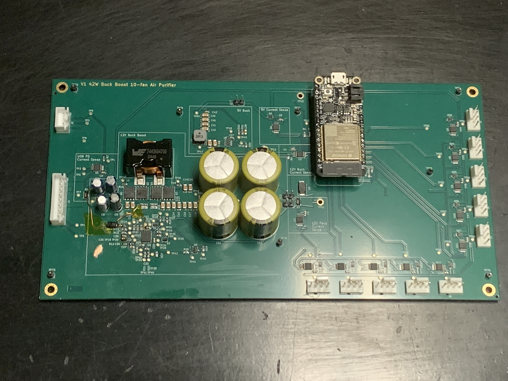

> **Notes:** Set expectations in one sentence: this is a complete design record, not a
> demo — and the most useful half of the talk is what happened *after* the board came back
> from the fab. Hold the board up if it is in the room.

---

## 2. The problem: particulate, twice a year and twice a day

- **Wildfire smoke** — seasonal, arrives in hours, lasts days
- **High-heat indoor cooking** — PM2.5 spikes, daily
- Commercial purifiers that move enough air are **too loud to sleep next to**

Three constraints fell out of that:

1. Quiet enough to run overnight in an occupied room
2. Consumer PC fans — large competitive market, quiet options, published curves, cheap replacements
3. Powered from a USB-C supply

> **Notes:** Constraint 3 is not primarily about efficiency. It is about **legibility** —
> "it draws about what charging a laptop draws" is a claim a non-technical housemate
> accepts without a power budget. A purifier that gets switched off at night cleans no air
> at night, so social acceptance is a design requirement, not a nicety.

---

## 3. Requirement: air changes per hour → CFM

- House: 1250 sq ft × 8 ft = **10,000 ft³** → 1 ACH = **167 CFM**
- **2–3 ACH continuous** → 333–500 CFM
- **4–6 ACH** during smoke / cooking / illness → 667–1000 CFM
- **Two units**, because inter-room air mixing is not assumed
- Per unit: **166 CFM continuous, 500 CFM high**

*(calculated — notebook 00, §2)*

> **Notes:** ACH is what public-health guidance is written in; CFM is what fans are sold
> in. The conversion is only the room volume. Two units at 166/500 CFM give 2 ACH
> continuous and 6 ACH peak — the top of the target band.

---

## 4. The unit: ten fans, two filters

- **10 × Arctic P14 Pro** behind **2 × 3M Filtrete 1900, 16×25**
- Filters on opposite faces — Clean Air Kit-style arrangement
- Airflow calculator (redheadhandicrafts): **832 CFM theoretical peak**, targets met at roughly **33 % and 67 %** fan PWM
- From experience with the built unit: 33 % is very quiet, 67 % audible but acceptable

*(calculator output — airflow deliberately not measured; scope decision, see notes)*

> **Notes:** If asked "did you verify the airflow?" — no, and that is a scope decision, not
> an oversight. Airflow is the *mechanism*; the goal is clean air, which depends on unit
> placement, enclosure sealing and filter grade (MPR 1900 vs 2500) at least as much as on
> CFM. Chasing absolute air-cleaning capability would be a project of its own. The
> calculator is fit for what it is used for here: picking a fan count and two speed
> settings. The honest upgrade — if someone pushes — is to build the flow calculation from
> the fan and filter P-Q curves rather than trusting a web tool, which needs both curves
> extracted first. Say that; don't over-apologise for it.

---

## 5. Why not just use a 12 V USB-PD trigger?

The obvious cheap answer — a trigger board that negotiates 12 V and feeds the fans
directly. Two reasons it was rejected:

- **12 V is not a required PD voltage.** Only 5 V is mandatory; 9/15/20 V appear above
  15 W. A 12 V trigger works only with the subset of chargers that happen to offer it.
- **A trigger is a passthrough.** The fans' commutation current pulses land straight on
  the supply and its cable, with no bulk capacitance in between.

> **Notes:** Prior art here is the redheadhandicrafts build, which does use a 12 V trigger.
> This is not a criticism of it — it is a different tradeoff. Converting costs a board;
> it buys compatibility with *any* PD supply the owner already has, plus decoupling of the
> fan load from the source.

---

## 6. The real load is not the nameplate

Ten fans × 0.35 A × 12 V = **42 W** — the number in the project's name. Measured at 100 %
PWM: **35.4 W**. The nameplate is **19 % high**.

And fan power does **not** follow the cube of PWM duty:

- measured **P ∝ PWM^1.56**, or **P ∝ rpm^2.07**
- the "quiet" setting costs **4.3 W, not 1.5 W** — 2.8×

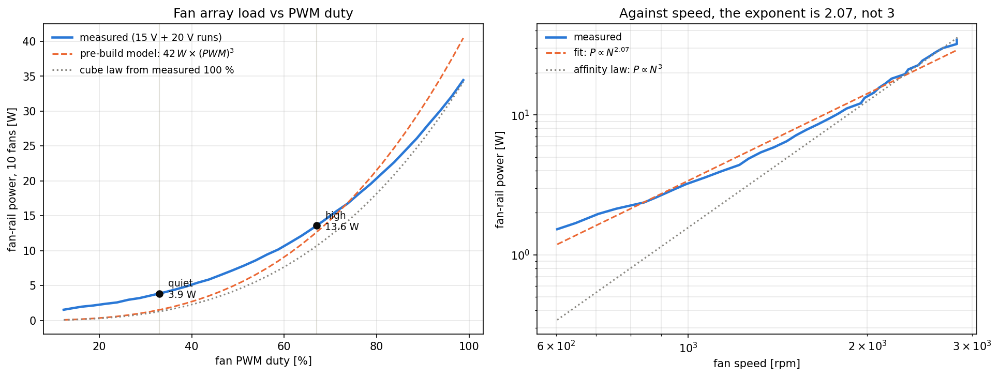

*(measured — notebook 00, §4; 2026-09-15 15 V and 20 V ramps, **fans in open air**)*

> **Notes:** Two effects compound. PWM duty is not speed fraction — these fans have a
> minimum speed, so 33 % duty is 40 % of max rpm. And even against *speed* the exponent is
> 2.07, because the fan's driver electronics and bearing friction are roughly fixed and
> dominate once shaft power has fallen off. This is the first of three pre-build
> assumptions the measurements overturned.
>
> **Volunteer the caveat before the panel finds it:** these runs had the fans on the bench
> with no enclosure, filters or static pressure, so they sat at a different point on the
> P-Q curve than the finished unit. Do not claim the enclosure figure will be lower —
> axial fans classically draw *more* power as flow is restricted. Repeating one ramp with
> the fans enclosed is a named open item (slide 36).

---

## 7. Mission profile — and why it doubled

| Setting | Duty | Assumed | Measured |
|---|---|---|---|
| quiet (33 %) | 95 % | 1.5 W | **4.3 W** |
| high (67 %) | 4 % | 12.6 W | **14.0 W** |
| peak (100 %) | 1 % | 42 W | **35.9 W** |
| **average** | | **2.35 W** | **5.0 W** |

Lifetime electricity at $0.20/kWh: **$4.12/yr → $8.75/yr** delivered.

*(measured — notebook 00, §5)*

> **Notes:** This is the weighting for optimization objective 2. It doubled. It does *not*
> change that objective's expected conclusion — see slide 12 — but a 2× error in the
> weighting is worth saying out loud rather than quietly correcting.

---

## 8. What the source gives vs what the load needs

- Load wants **12 V**, fixed
- Source offers **5, 9, 15, 20 V** — and only 5 V is guaranteed
- 12 V sits **inside** the input range

→ Neither a buck nor a boost alone will do. **4-switch buck-boost.**

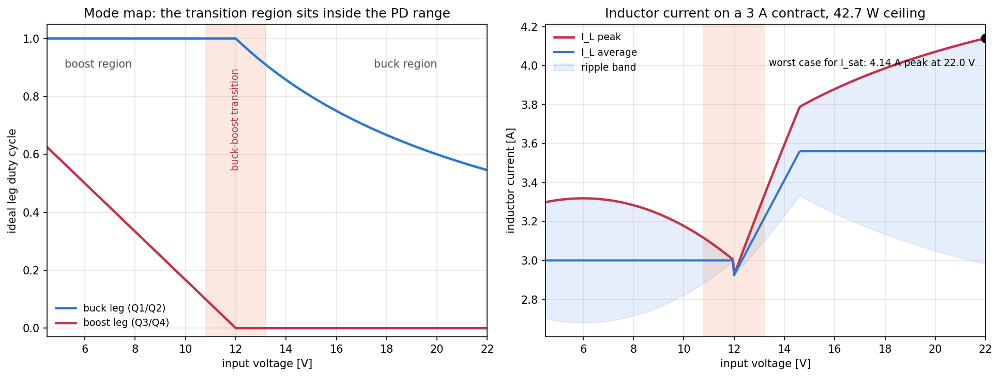

*(calculated — notebook 01, §3)*

> **Notes:** The left panel is the whole argument for the topology in one picture: the
> transition region sits on top of 12 V, right in the middle of the PD range. Note the two
> legs are plotted separately — a single "duty cycle" curve would invent a discontinuity
> the converter does not have.

---

## 9. The operating envelope, and where optimization has to happen

- On a 3 A contract: **source-limited below 14.6 V, load-limited above**
- Below the crossover, every milliwatt of loss **subtracts from fan speed**
- Above it, the source has power to spare and loss only costs electricity

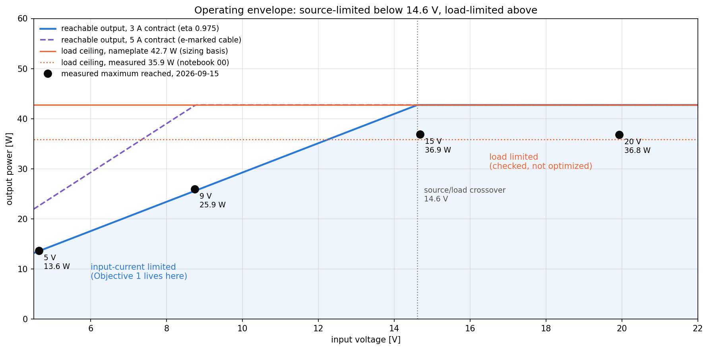

*(calculated envelope, measured maxima — notebook 01, §2)*

> **Notes:** This slide justifies the whole optimization strategy. It is why 5 V / 3 A is
> optimized and 9/15/20 V are only checked. The four black dots are what the board
> actually reached on the bench: the 5 V and 9 V runs were stopped by the input-current
> limit, 15 V and 20 V by the fans running out of load.

---

## 10. Objective 1 — efficiency at the source-limited corner

**Maximize efficiency at V_in = 5 V, I_in = 3 A (15 W), boost. Part cost unconstrained.**

- This is a USB battery bank, or a plain Type-C 3 A source
- Lowest input voltage, highest input current, highest boost ratio
- Source is *power-limited*, so efficiency buys **capability**, not electricity
- In boost, I_L,avg = I_in = 3 A **independent of efficiency**

Measured at that corner: **97.2 %**, 0.39 W of loss. Delivers 64 % PWM — the "high" setting.

*(measured — notebook 01, §4)*

> **Notes:** Worth landing the nice result: a plain 5 V / 3 A battery bank runs the
> purifier at essentially exactly the 67 % high setting it was designed around. That is a
> coincidence, not a design intent, but it means the unit is genuinely portable.

---

## 11. Objective 2 — BOM + lifetime electricity

**Minimize board cost (50-board build) + electricity over the mission profile, 10 years.**

- Delivered energy over the profile: **≈ $8.75/yr**, ≈ $88 over 10 years
- Candidate parts differ by **tens of milliwatts at 15 W** — and the profile spends 95 % of
  its hours at a quarter of that current
- Expectation: **BOM-dominated**, and likely to favour different parts than Objective 1

Status: **not yet implemented** (notebook 09).

> **Notes:** Be honest that this is unfinished. The interesting part is that the two
> objectives are expected to disagree, and the notebooks are written to say so explicitly
> rather than silently pick a winner. Also flag the constant 0.44 W housekeeping buck: at
> this profile it outweighs every power-stage part difference in notebooks 03 and 04, and
> it was never analysed.

---

## 12. What V1 deliberately did not attempt

| Not attempted | Why |
|---|---|
| ZVS / soft switching | Outside my experience. Timing and dead-time design needed study I could not fit before the first spin, with real risk of a board that does not work. |
| Multiphase interleaving | Same unfamiliarity, more parts, more layout risk, no benefit at the power level that actually constrains this design. |

**V1's goal was a reliable first spin across the whole PD range — not a maximally
efficient converter.**

> **Notes:** Say the position plainly: an understood topology that works is worth more
> than an efficient topology I would be debugging for the first time. Both remain V2
> directions. Expect a panel question here; the answer is that the binding constraint was
> my own unfamiliarity, and I would rather name that than dress it up.

---

## 13. Design flow

| # | Decides |
|---|---|
| 00 | Requirements, load, mission profile |
| 01 | Operating envelope, power budget |
| 02 | Measured fan commutation current — the real load |
| 03 | L = 47 µH, Würth 7443634700 |
| 04 | BSC0902NSI switches |
| 05 | C_out = 4 × 4.7 mF + ceramics, C_in = 4 × 47 µF |
| 06 | Ripple across the input range |
| 07 | Loop compensation — deliberately slow, f_bw ≈ 11 Hz |
| 08 | Input filter redesign (v1 rework) |
| 10 | UVLO lockout latch |
| 11 | Measured vs modeled efficiency |

> **Notes:** One slide so the panel knows the shape of the record. Don't read it out.

---

## 14. The load is not a resistor

Measured single-fan current into a 1.57 Ω shunt, scaled to the array:

- Roughly **trapezoidal commutation at ≤ 160 Hz** (2500 rpm, 4-pole)
- **Startup peak ≈ 2× steady state** near half speed
- Peak power nearly **double** the average

This waveform drives capacitor sizing (05) and forced the input-filter redesign (08).

<!-- TODO: export the commutation-zoom and startup-ramp plots from notebook 02 to figures/ -->

*(measured — notebook 02)*

> **Notes:** This is why the rated 0.35 A per fan is not the design input. A converter
> sized to the average and a converter sized to the pulse are different converters.

---

## 15. Inductor: 47 µH, Würth 7443634700

- Sized for saturation at the **high-voltage full-load corner**: 22 V in, 42.7 W out →
  **4.14 A peak** *(calculated)*
- Not the boost corner — there the 3 A input limit caps the inductor at 3 A average
- Loss at the 5 V / 3 A point: **122 mW**, ΔT ≈ 3.0 K *(Würth REDEXPERT)*
- At 47 µH the ripple is small (0.62 A pk-pk), so **DC loss dominates** (110 of 122 mW)

> **Notes:** The counterintuitive bit is the corner. In buck the inductor carries the
> *output* current, so full load at the top of the PD range is the saturation worst case —
> while the *efficiency* worst case is at the bottom. Easy to get backwards; I did, in an
> earlier draft of notebook 01.

---

## 16. Inductor: what the comparison actually showed

- V1's original comparison estimated AC loss from a **SPICE model's parallel resistance**,
  not manufacturer core-loss data
- Redone with REDEXPERT / Coilcraft data for 15 parts at 100 kHz
- **Eight parts beat the V1 part** (38–104 mW vs 122 mW) — 17–84 mW less loss
- **None of the eight is stocked at JLCPCB** (checked 2026-09-14)

→ The V1 part is the lowest-loss *stocked* part, not the lowest-loss part.

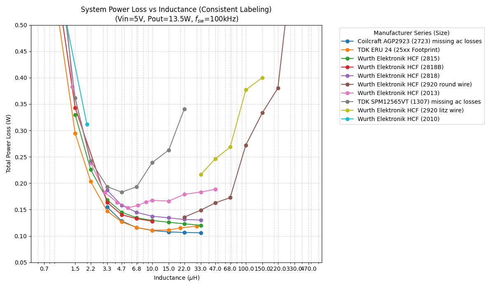

> **Notes:** This is the honest version of "we picked the right part." We picked the right
> part *from what we could buy*. Coverage is also incomplete — TDK ERU 24 and SPM12565VT
> still have no manufacturer loss data, and by notebook 03's budget the ERU 24 could still
> win if its AC loss is under 89 mW.

---

## 17. MOSFETs — and a data-quality failure

- V1 wanted a **40 V** part, for input margin at 20 V PD
- The parts table said BSC0902NS was 40 V. **It is a 30 V part** — and so is the
  BSC0902NSI actually fitted
- Cause: 16 of 19 rows were drafted with AI help and committed **without checking against
  datasheets**. Most values did not match; five part numbers did not exist at their
  manufacturer

**V1 does not have the input margin it was chosen for.**

> **Notes:** Do not soften this. It is the most instructive failure in the project and it
> is a *process* failure, not a circuit one. The table has since been re-transcribed from
> datasheet tables with revision and test conditions per row. Whether 30 V is actually
> enough on the input side still needs a switch-node measurement at 20 V in — not yet done.

---

## 18. MOSFETs — where V1 landed once the data was right

- Evaluated at the **LM5176's actual gate voltage** (BIAS tied to VOUT → 7.35 V), with
  C_oss, dead-time and reverse-recovery loss added
- BSC0902NSI at the 5 V / 3 A point: **136 mW**, #4 of 16 *(calculated from datasheet)*
- 24 mW above the best part checked
- **BSZ0501NSI** is 14 mW lower, at **$1.49 more per board** (50-board DigiKey pricing) →
  recorded as a V2 candidate

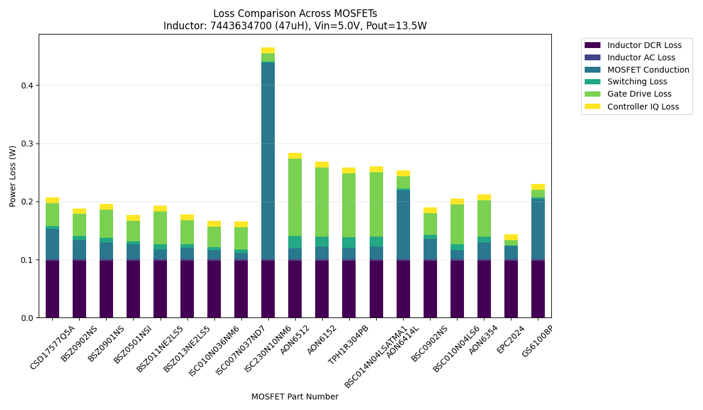

> **Notes:** Note the shape of the tradeoff: 14 mW for $1.49. At the mission profile that
> is worth cents a year. This is exactly where objectives 1 and 2 disagree.

---

## 19. Capacitors and ripple

- **C_out = 4 × 4.7 mF bulk + ceramics** — sized by the fan commutation pulse, not by
  switching ripple
- **C_in = 4 × 47 µF**
- Ripple checked across the full input range at 100 kHz *(calculated — notebook 06)*

<!-- TODO: pick one ripple-vs-Vin figure from notebook 06 and export it to figures/ -->

> **Notes:** Cuttable slide if running long. The one point worth keeping: the bulk
> capacitance is set by a 160 Hz load pulse, not by the 100 kHz switching frequency, which
> is why it is millifarads and not microfarads.

---

## 20. The loop is deliberately slow

**f_bw ≈ 11 Hz.**

- The fan array's commutation current is a ≤ 160 Hz disturbance
- A fast loop would **fight it** — modulating the converter against every commutation pulse
- So the loop is set well below it and the bulk capacitance absorbs the pulse instead

*(calculated / simulated — notebook 07)*

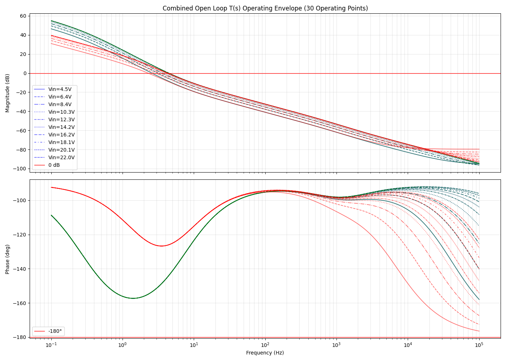

> **Notes:** Remember this slide — it comes back three more times, and the arc is worth
> making explicit because it shows the design was reasoned as a system:
>
> 1. **Slide 23** — it is why TI's suggested fix for the startup failure was unusable.
> 2. **Backup B1** — it confines the converter's negative input resistance to below ~11 Hz,
>    which makes the input-filter (Middlebrook) interaction a non-problem and leaves the
>    RHP zero 566× away.
> 3. **Backup B2** — it is also the *cost*: at full load the output rises to the TVS clamp
>    in 13 ms against a 14.5 ms loop time constant, so the TVS is load-bearing.
>
> One deliberate choice, one consequence in each direction. If a panel member only
> remembers one thing about the loop, make it this.

---

## 21. Input filter — designed, then redesigned

- Measured input behaviour did not match the pre-build assumption
- Redesigned using an **average-current-limit method**
- Implemented as a **rework on the v1 PCB**

*(measured → redesigned — notebook 08)*

> **Notes:** A miniature of the whole project's loop: design → measure → revise. Worth
> 30 seconds because it shows the method working on a small problem before Act 4 shows it
> working on a large one.

---

## 22. The board came back. Then it didn't start.

**Failure:** after a brief VIN dropout, the LM5176 restarts badly into a still-charged
output. Pre-bias startup misbehaves.

- Reproducible on the bench
- **TI support could not root-cause it**
- TI's only suggestion: **raise the crossover frequency**

> **Notes:** Pause here. This is the pivot of the talk. Everything before was design;
> everything after is what design is actually like.

---

## 23. Why TI's suggestion was unusable

Raising crossover frequency directly contradicts **slide 20** — the loop is slow *on
purpose*, to avoid fighting the fan array's 160 Hz commutation current.

Taking TI's fix would have traded a startup bug for a steady-state one.

→ Needed a fix that leaves the loop alone.

> **Notes:** This is the moment the design record pays for itself. Because notebook 07
> documents *why* f_bw is 11 Hz, it was immediately obvious that the vendor's suggestion
> was not acceptable. Without that written down, it would have been tempting to just try it.

---

## 24. The fix: a discrete lockout latch

**Pull EN/UVLO low on input dropout, and hold it there until the output has discharged —
so the LM5176 only ever starts into a known state.**

- Powered from VOUT
- TLV431-based, three-resistor divider
- Schematic: `simulation/en_uvlo_lockoutv3_tlv.asc`

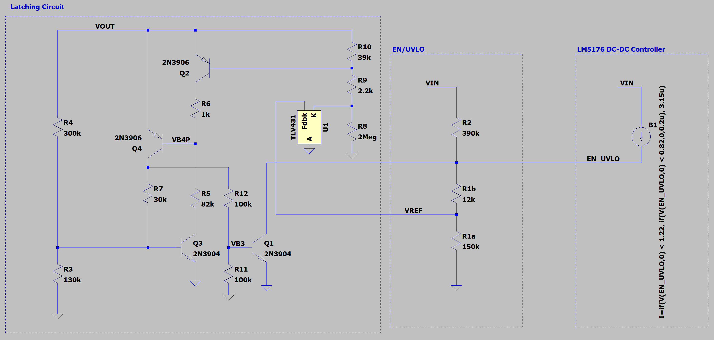

> **Notes:** The idea is simple. Making it work over tolerance was not.

---

## 25. The feasible region is a sliver

Four simultaneous constraints on the divider, over tolerance:

- must turn **on** before 4.50 V
- must **not** turn on before 3.80 V (gate health)
- must be **off** below 3.60 V
- hysteresis gap, and a 500 µW divider power budget

Searched over **JLCPCB basic parts** only.
Result: **R2 = 390 k (120 k + 270 k), R1a = 150 k, R1b = 12 k**

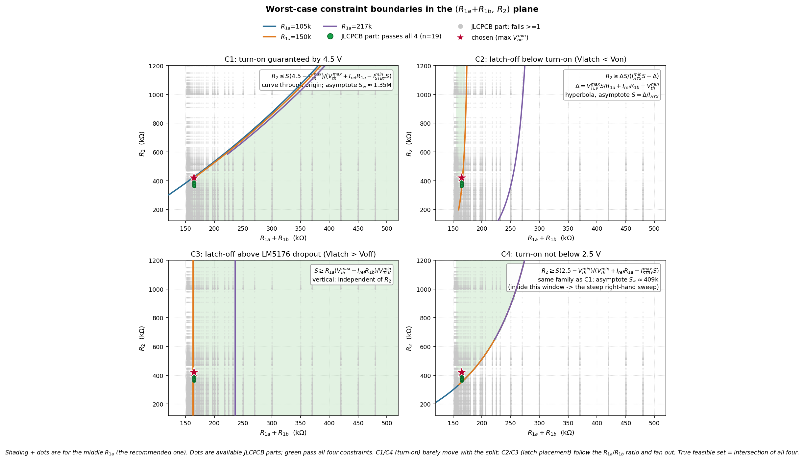

*(worst-case search — `uvlo/10a_uvlo_resistor_search.py`; derivation in `uvlo/uvlo_tlv431.pdf`)*

> **Notes:** Emphasise "over tolerance" and "parts actually stocked." The nominal design
> is easy; the feasible region only becomes thin once both are applied. This is the slide
> that shows the work.

---

## 26. Verified three ways

- **Worst-case DC analysis** — `uvlo/10b_uvlo_latch.py`
- **LTspice** — `simulation/en_uvlo_lockoutv3_tlv.asc`
- The script **cross-checks itself against the LTspice `.raw` output automatically**

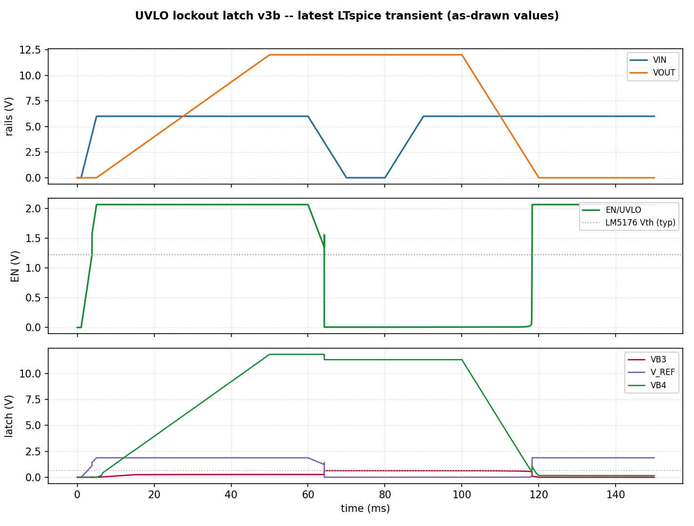

> **Notes:** The automatic cross-check is the part worth mentioning to a panel: hand
> analysis and simulation disagreeing silently is a classic way to ship a bug, so the
> script fails loudly if they diverge.

---

## 27. Result

The rework wire visible near the EN/UVLO network on slide 1 **is** this latch.

Board starts reliably across the PD range.

<!-- TODO: add a before/after scope capture from measurements/prebias startup/ -->

> **Notes:** Keep short. If a before/after capture can be exported in time, this slide is
> much stronger with it than with text.

---

## 28. Measuring it properly

- **14 × INA226** on the board — input, fan rail, 5 V buck in/out, ten per-fan channels
- ESP32 logger, PWM ramped 0 → 100 → 0 % against a fixed bench supply voltage
- Four clean 10-fan runs: **5, 9, 15, 20 V** (2026-09-15)
- Shunts **calibrated against a DMM** in the real current path

> **Notes:** The board instrumenting itself is why there is per-fan data at all. Point out
> that output power is taken from the sum of the ten per-fan shunts, not the single fan-rail
> shunt — the fan-rail shunt reading depends on how current is fed to its pads.

---

## 29. Calibration honesty

| Channel | Fit used | Effective shunt |
|---|---|---|
| input | 0.8996 × nominal + 4.3 mA | 1.112 mΩ |
| fan rail | 0.9141 × nominal − 0.7 mA | 1.094 mΩ |
| ten per-fan | 0.9852 × nominal + 2.4 mA | — |

- DMM readings **fluctuated**; each entered value is a visual median
- Bias from reading a median by eye is **not quantified**
- Below ~2 W, fan-rail offset limits efficiency precision to about **±1.3 points**

> **Notes:** Volunteer the caveats before the panel finds them. The 10 % shunt corrections
> are large, and anyone quoting the absolute efficiency numbers needs to know the
> uncertainty. This slide buys credibility for slides 30–33.

---

## 30. Measured efficiency

- Peak **97.7 % (5 V)** to **99.3 % (15 V)**
- Objective 1 corner (4.64 V, 3.02 A in): **97.2 %**
- 5 V and 9 V runs stopped by the 3 A input limit; 15 V and 20 V by the fans

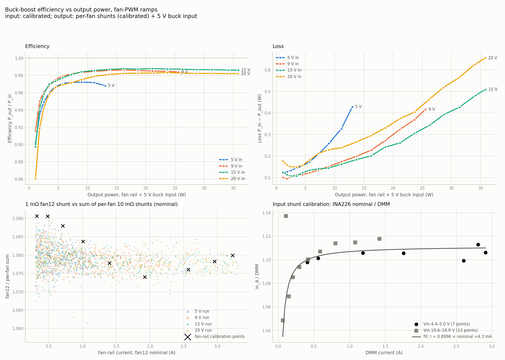

*(measured)*

> **Notes:** The board works and works well. Resist over-claiming: these are DMM-corrected
> INA226 readings with the uncertainties on the previous slide, not a calibrated power
> analyser.

---

## 31. The model is optimistic everywhere

- Above ~5 W the notebook 03/04 model predicts **0.25–1.0 points more efficiency** than
  measured
- At ~3 A inductor current it accounts for **68 %** of measured loss in boost, **59 %** at
  15 V, **55 %** at 20 V
- At the Objective 1 corner: **96.8 % measured vs 97.8 % calculated**

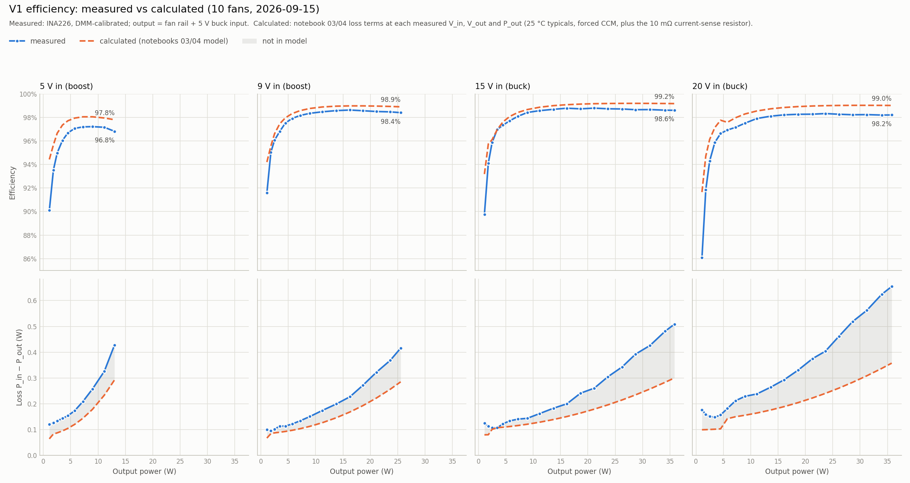

*(measured vs calculated — notebook 11)*

> **Notes:** No V1 part choice changes from this. But the unexplained 0.13 W at the design
> corner is **larger than the 14–84 mW part differences notebooks 03 and 04 rank parts on**.
> That bounds how much weight those rankings deserve — they compare modeled terms, not
> board loss. This is the single most important caveat in the whole project.

---

## 32. Where the 0.39 W goes

| Term | Loss | Source |
|---|---|---|
| Inductor | 122 mW | REDEXPERT |
| MOSFETs | 136 mW | datasheet model, 7.35 V gate |
| **modeled total** | **258 mW** | **66 % of measured** |
| unexplained | ~130 mW | sense resistors, controller I_q, copper, gate drive |

> **Notes:** Name what is *not* in the model, rather than implying the remainder is
> mysterious. Sense-resistor loss and controller quiescent current are known quantities
> that simply were never added up; board copper is the genuinely hard one.

---

## 33. Which PD voltage should it negotiate?

At the **quiet** setting — 95 % of operating hours:

| V_in | η | loss |
|---|---|---|
| **9 V** | **97.44 %** | **113 mW** |
| 15 V | 96.98 % | 134 mW |
| 5 V | 96.84 % | 140 mW |
| 20 V | 95.70 % | 193 mW |

**9 V wins. 20 V is the worst.** Difference: 80 mW, ≈ $1.33 over 10 years.

*(measured — notebook 01)*

> **Notes:** Small money, but it is a **firmware** choice in the PD negotiation, not a part
> cost — so it is free to take. It also runs against the intuition that higher input voltage
> is always better: that holds at the top of the efficiency curve, not at 4.3 W out. Caveat
> it with the ±1.3-point precision note from slide 29.

---

## 34. An envelope constraint that isn't steady-state

All ten fans share one PWM signal → **they start together.**

- At 5 V, the simultaneous start tripped the 3 A input limit in **three consecutive attempts**
- One 282 ms window showed **3.82 A** nominal input before the ramp reversed
- A successful run differed only in that the surge split across two readings

**Worst input current is a startup transient, not a full-load operating point.**
Fix is firmware — stagger fan starts across the ten PWM pins. **Not fixed on V1.**

> **Notes:** Good example of something no amount of steady-state power budgeting would have
> found. It only showed up because the logger captured the ramp.

---

## 35. Known gaps in the V1 selection method

1. **AC core loss was approximated** from a SPICE parallel resistance, not manufacturer data
2. **Part cost was never in the optimization** — no basis for trading efficiency against price
3. **Coverage is incomplete** — several candidate families still have no loss data
4. **The MOSFET table was not datasheet data** (slide 17)

**Neither V1 power part is a verified optimum for Objective 1.**

> **Notes:** Listed rather than quietly patched, because they change how much weight the V1
> conclusions deserve. A panel will respect this far more than a clean story.

---

## 36. V2 candidates

| Change | Basis |
|---|---|
| BSZ0501NSI switches | 14 mW lower loss, +$1.49/board |
| Lower-loss inductor | 8 parts 17–84 mW better — **need a supplier that stocks one** |
| Verify 30 V FET margin | switch-node measurement at 20 V in — **not yet done** |
| Stagger fan starts | firmware; fixes the 5 V start surge |
| Analyse the 5 V housekeeping buck | constant 0.44 W, never in scope for V1 |
| ZVS / multiphase | out of scope for V1 — revisit with experience |

**Two measurements that should happen before this talk, not after:**

- **Re-run one full ramp (15 V or 20 V) with the fans in a representative enclosure.** The
  headline load numbers on slides 6–7 are all open-air.
- **Run one fan per header.** Ten fans across three headers means per-fan current and speed
  were never resolved — the board has ten INA226s and tach inputs that would give it free.

> **Notes:** The housekeeping buck is the sleeper. At the mission profile its constant
> 0.44 W outweighs every power-stage part difference argued about in notebooks 03 and 04,
> and nobody looked at it.
>
> The two measurements above are cheap — a bench afternoon — and they close the biggest
> open item in the requirements half of the talk. If they are done in time, update slides
> 6, 7 and 33 and delete this block.

---

## 37. What I would tell myself before V1

- **Check the data before designing on it.** The MOSFET table cost the design its voltage margin.
- **Measure the load before sizing for it.** Nameplate was 19 % high; the power-vs-speed law was wrong by 2.8× at the setting that matters.
- **Write down *why*, not just *what*.** Notebook 07's rationale is the only reason TI's suggested fix was recognised as unusable.
- **Measure it in the configuration you ship.** The load numbers are open-air; the product has an enclosure and filters.

> **Notes:** Land the talk here rather than on a summary. These are the transferable
> lessons; the LM5176 specifics are not.

---

## 38. Status

- **V1: designed, fabricated, assembled, measured, and fixed.** Works across the full PD range.
- Objective 1: characterised, **not optimised** — parts are 14–84 mW off best-available
- Objective 2: **not yet run** (notebook 09)
- Open: load measured open-air only; 30 V margin unverified; fan start surge unfixed;
  airflow not measured (by choice)

**Repo:** notebooks 00–11, `uvlo/`, LTspice, measured data, part databases — the complete record.

> **Notes:** End on what is true, not on a flourish. Then take questions.

---

## Q&A — likely questions and short answers

- **"Why not a 12 V trigger board?"** → slide 5
- **"Why hard-switched at 42 W?"** → slide 12; unfamiliarity was the binding constraint, and I would rather name it
- **"97 % seems high — how do you know?"** → slide 29; DMM-corrected INA226, ±1.3 points below 2 W, not a power analyser
- **"Why is the model 30 % off?"** → slide 32; sense resistors, I_q and copper were never added up
- **"Isn't 42 W the wrong sizing basis if the load is 35 W?"** → it errs conservative, so every margin downstream is larger than claimed; the measured figure is used where it matters, in the mission profile
- **"Did you measure the fans in the actual enclosure?"** → no, open air only; named open item, and the direction of the error is not obvious because axial fan power rises as flow is restricted
- **"Did you verify the airflow?"** → no, by choice — slide 4 notes
- **"Do you need an EMI input filter? Middlebrook?"** → **backup B1**
- **"Will the fans push energy back into your output?"** → **backup B2**
- **"What would you do differently?"** → slide 37

---

# Backup slides

*Not in the 39-slide flow. Shown only if asked. B1 and B2 were both asked in a phone
screen by a lead principal power engineer, so have them one keypress away.*

---

## B1. Input filter, EMC, and the Middlebrook criterion

**What V1 has: no EMI filter.** Input is 4 × 47 µF electrolytic + 2 × 10 µF ceramic
(208 µF), no series element, no common-mode choke. **Conducted emissions were never
measured.** Notebook 08's "input filter" is a different thing — it uses the LM5176's
average input-current limit and soft-start to smooth the *fan commutation* draw, not to
attenuate 100 kHz switching noise.

**Do I need one?** For compliance, yes, and it is untested. For *stability*, the numbers
say a filter would be easy to add:

| Corner | P_in | Z_in = −V_in²/P_in |
|---|---|---|
| 5 V boost (Objective 1) | 15 W | **−1.67 Ω** ← worst |
| 9 V boost | 27 W | −3.00 Ω |
| 15 V buck | 43.8 W | −5.14 Ω |
| 20 V buck | 43.8 W | −9.13 Ω |

Sketch: add **L_f ≈ 2.2 µH** ahead of the existing 208 µF → f₀ = 7.4 kHz, Z₀ = 0.103 Ω,
≈ 45 dB at 100 kHz. Damped by the electrolytics' own ESR, **Q ≈ 0.7 → peak |Z_out| ≈ 0.10 Ω,
a 16× margin** against the 1.67 Ω worst-case |Z_in|.

*(calculated — sketch, not a verified design; no EMC measurement exists)*

> **Notes — the three points to make, in order:**
>
> 1. **Be straight that V1 has none and it is untested.** Don't dress up the bulk caps as
>    a filter.
> 2. **The slow loop makes Middlebrook nearly free.** A converter looks like a negative
>    resistance only where its loop regulates. With f_bw ≈ 11 Hz, that region ends around
>    11 Hz, while the filter resonance sits at 7.4 kHz — nearly three decades apart. The
>    same 11 Hz choice that caused the startup fight (slide 23) makes the input-filter
>    interaction a non-problem. That connection is the interesting answer, not the
>    component values.
> 3. **Name the worst corner correctly:** 5 V, because |Z_in| = V²/P is smallest at low
>    input voltage and high power. Same corner as Objective 1, opposite corner from
>    inductor saturation (slide 15). Knowing which corner binds which constraint is the
>    thing being tested.
>
> **If pushed further:** Middlebrook is the *conservative* criterion — it demands
> Z_out ≪ Z_in at all frequencies. Less conservative alternatives (GMPM / opposing-argument
> / three-step impedance criteria) allow the impedances to approach where phase permits. I
> would not need them here given a 16× margin.
>
> **EMI-worst corner is buck, not boost** — buck draws discontinuous input current
> (1.74 A AC rms at 20 V in), boost draws continuous. So the EMI corner and the efficiency
> corner are at opposite ends of the input range. Good thing to volunteer unprompted.
>
> **Honest gap to admit:** no LISN measurement, no CISPR limit line, no common-mode
> consideration at all — and CM is usually what fails first. A differential-mode pi filter
> would not fix a CM problem.

---

## B2. Do the fans push energy back? And should there be a crowbar?

**Short answer: not meaningfully — but the reason is the blocked path, not energy.**

- The fans are 4-wire BLDCs with an internal driver. Remove the rail and the driver stops
  commutating; return is through body diodes only, and only while back-EMF exceeds the
  rail.
- **The energy argument does not work.** Ten coasting rotors hold ≈ 20–40 J (order of
  magnitude, inertia not measured) against C_out's **1.36 J**. What saves the design is
  that aerodynamic drag dissipates it over a ≈ 0.6 s spin-down, not that there is little of it.
- **Measured:** the existing stop capture shows reverse current peaking at **≈ 10 % of the
  running current**, sub-millisecond, with zero mean afterwards.

**The real overvoltage risk is load dump, and it is caused by the slow loop:**

| | dV/dt | 12 V → 14.4 V |
|---|---|---|
| at 13.6 W | 60 V/s | 40 ms |
| at 42.7 W | **188 V/s** | **13 ms** |

Loop time constant 1/(2π·11 Hz) = **14.5 ms**. **The loop cannot respond before the TVS
conducts.** Inductor energy is irrelevant — dumping all of it raises V_out by 1.3 mV.

**Crowbar: no.** It protects against *sustained* overvoltage from a failed pass element.
Here the event is a bounded, self-limiting transient the TVS already absorbs, and a
crowbar adds a nuisance-fire mode that bricks the unit.

*(measured stop capture — conditions undocumented; overshoot calculated)*

> **Notes:**
>
> - **Lead with the mechanism, not the energy.** If you say "the fans don't store much
>   energy" a principal engineer will do the ½Jω² in their head and it is ~20 J against
>   1.36 J in C_out. The correct argument is: the return path is through the driver's body
>   diodes and only conducts while back-EMF > rail, and the kinetic energy leaves as air
>   movement over ~0.6 s. Get this the right way round.
> - **The TVS is load-bearing, not belt-and-braces.** 13 ms to clamp vs a 14.5 ms loop time
>   constant is the whole justification. This is the third place the 11 Hz choice comes
>   back (after slides 20 and 23) — make that arc explicit; it shows the design was
>   reasoned as a system.
> - **Say what actually limits the rating.** The fans tolerate overvoltage fine. The 35 V
>   bulk caps and 50 V ceramics are fine. The exposed parts are the **TPS563201 5 V buck**
>   and the LM5176's BIAS pin, both fed from the 12 V rail. **TODO before presenting:
>   confirm the TPS563201 absolute-max input from its datasheet — it is not in the repo.**
>   If its rating is below the clamp voltage, the TVS selection is set by the housekeeping
>   buck, not by the fans, and that is worth saying.
> - **Caveat the capture honestly if pressed:** the stop capture predates the current
>   measurement setup, and its probe attenuation and whether the stop was PWM-commanded or
>   a supply removal are not recorded. The 10 % figure is a ratio, so it survives the
>   scaling ambiguity — but the clean experiment is to cut the converter at full speed and
>   watch V_out and input current together. Not yet done.
> - **Where a crowbar *would* be right:** protecting expensive downstream silicon from a
>   shorted series pass element, where the overvoltage is sustained and the load cannot
>   tolerate it. Saying where it *does* apply shows you rejected it on analysis, not
>   reflex.

---

# Anticipated questions — notes only, no slides

*Answers to have ready. Nothing here needs a slide; several are honest "not analysed".*

**Bootstrap refresh in deep boost.** In boost the buck-leg high side sits ~100 % on, so a
bootstrap cap has no obvious refresh window — a classic 4-switch buck-boost trap.
Empirical answer: the board ran 120 s PWM ramps at 4.64 V in without misbehaving, so
whatever refresh the LM5176 uses works. *Have the LM5176 datasheet open — it is in
`datasheets/controllers/lm5176.pdf`; I have not read its refresh mechanism.*

**Right-half-plane zero in boost.** f_RHPZ = R_load(1−D)²/(2πL) → **6.2 kHz at 5 V in**,
10.6 kHz at 9 V. That is **566×** above the 11 Hz crossover, so the RHPZ never constrained
the loop. Another case of the slow loop making a hard problem disappear. *(calculated)*

**Electrolytic lifetime over a 10-year target.** Four 4700 µF radials carrying the fan
commutation ripple. **Not analysed** — no ripple-current budget, no ESR-ageing or
Arrhenius life calculation was done. Mitigating: the mission profile is 95 % at ~4 W, so
ripple and self-heating are low nearly all the time. *This is the gap I would most expect
a reliability-minded interviewer to find; datasheets are in `datasheets/Capacitors/`.*

**Thermal.** Inductor ΔT ≈ 3.0 K at the 5 V corner (REDEXPERT). No heatsinks anywhere; FET
junction temperatures were never measured, only modelled. No thermal imaging was taken.

**Layout and EMI practice.** Followed AN-139 (`app_notes/`): minimised switch-node copper,
tight gate loops, sense lines routed as a pair. **No EMC measurement**, so this is
process, not evidence.

**Gate drive.** Dead time 45 ns typical (datasheet); gate resistors per the Infineon app
note in `app_notes/`. C·dv/dt-induced shoot-through was not explicitly analysed.

**Current sense.** 10 mΩ, as 2 × 20 mΩ 0612 in parallel (R22/R23). Slope compensation and
current-limit accuracy were not independently verified against the datasheet.

**PD negotiation and voltage transitions.** The design is checked to the PD worst case of
**21.5 V** on a 20 V contract (±5 % plus the ±0.5 V transition allowance), which is why
`constants.USB` carries a wider ±10 % project margin. What happens if the source
renegotiates *mid-operation* was never tested — a real gap, and the converter has to ride
through it.

**Startup inrush.** Charging 18.89 mF to 12 V is 1.36 J; at the 15 W 5 V limit that is
≥ 91 ms of pure charging before any load. Handled by the LM5176's soft-start plus average
input-current limit — which is exactly what notebook 08 designs around.

**Why 100 kHz?** Lower switching loss, at the cost of larger passives and more inductor AC
loss. Measured, it was the right call for this part: the V1 inductor barely improves from
100 → 300 kHz (122 → 114 mW) because DC loss dominates at 47 µH.

**Protection generally.** OCP and thermal shutdown are the LM5176's. Output short
behaviour was not tested. Output OV relies on the TVS (B2).

**"What would you do with more time or budget?"** In order: the enclosure load measurement
(slide 36), a conducted-emissions scan, the electrolytic life calculation, and then
Objective 2 — before any ZVS or multiphase work.

<!-- TODO before presenting:
     HIGH VALUE - bench work, closes the biggest open item in the talk:
     - re-run one full ramp (15 V or 20 V) with the fans in a representative enclosure,
       then update slides 6, 7, 33 and the notebook 00 mission profile
     - run one fan per header, to resolve per-fan current and speed spread
     FIGURES:
     - export notebook 02 commutation + startup figures to figures/
     - export one ripple-vs-Vin figure from notebook 06
     - before/after prebias startup scope capture for slide 27
     SMALL:
     - confirm the fan model (count is confirmed at ten)
     - decide whether to cut slides 19 and 21 for time
     - BACKUP B2: confirm the TPS563201 absolute-max input voltage from its datasheet
       (not in the repo) - it may be what sets the output TVS clamp, not the fans
     - BACKUP B1: read the LM5176 bootstrap refresh mechanism in
       datasheets/controllers/lm5176.pdf before being asked about deep-boost operation
-->
